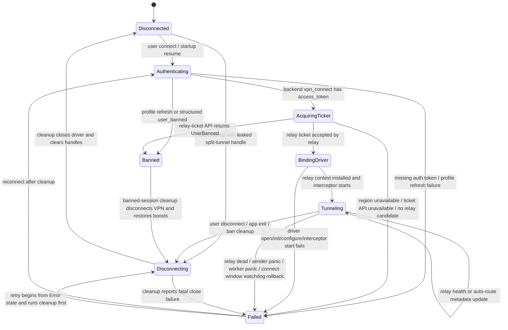

# VPN Lifecycle State Machine

This document maps the Windows desktop connect, disconnect, and reconnect lifecycle across `swifttunnel-core/src/vpn/connection.rs` and the packet path in `swifttunnel-core/src/vpn/parallel_interceptor.rs`.

Primary tunnel success is all of the following at once:

- Packets are flowing through the selected relay.
- The WinpkFilter/ndisapi driver is opened, initialized, configured, and bound to packet workers.
- A valid relay ticket was accepted by the relay for the active `session_id`.

Driver attachment, relay socket creation, or a UI `Connected` state are secondary signals. They must not mask relay ticket, packet flow, or driver binding failure.

## State Diagram

The app exposes `Disconnected`, `FetchingConfig`, `ConfiguringSplitTunnel`, `Connected`, `Disconnecting`, and `Error`. The diagram below maps those implementation states onto the conceptual lifecycle requested for audit.

States entered from more than one source:

- `Authenticating`: from `Disconnected` and from `Failed` retry.
- `Failed`: from `Authenticating`, `AcquiringTicket`, `BindingDriver`, `Tunneling`, and cleanup failure.
- `Disconnecting`: from `Disconnected` with a leaked handle, `Tunneling`, `Failed` retry cleanup, and `Banned`.
- `Tunneling`: from initial `BindingDriver` success and in-place relay metadata updates.

## Failure-Mode Classification

| Boundary | Failure signal | Classification | Required behavior |
| --- | --- | --- | --- |
| Profile/auth refresh | Structured `AuthError::UserBanned` or banned profile | Fatal account state | Enter `Banned`, disconnect VPN, restore boosts, skip startup boost reapply. |
| Server selection | No API-available relay candidate for region | Fatal for attempt | Set `Error`; do not create driver/relay. |
| Relay-ticket request | `UserBanned` | Fatal account state | Close driver if opened, return `VpnError::UserBanned`, run banned cleanup. |
| Relay-ticket request | API/network/401 failure without structured ban | Retryable by future connect | Refuse unauthenticated fallback, close driver, return `Error`. |
| Relay auth ack | `Ok` | Success marker | Candidate may enter `BindingDriver`. |
| Relay auth ack | `Replay` status `7` | Fatal for current attempt, retryable only with fresh connect/ticket | Do not reuse stale ticket/session as success. Close driver and fail the attempt. |
| Relay auth ack | `AuthDisabled`, `BadFormat`, `BadSignature`, `Expired`, `SidMismatch`, `ServerMismatch` | Fatal candidate; failover if another candidate authenticates | If none authenticate, close driver and fail. |
| Relay auth ack | Timeout | Retryable within bounded auth hello budget and candidate failover | If none authenticate, close driver and fail. |
| Driver FFI | Driver unavailable/open/init/configure fails | Repairable by driver repair/install or reconnect | Close any opened driver handle and fail the attempt. |
| Interceptor startup | Reader/inbound/worker startup failure | Repairable by reconnect/driver repair depending on panic cause | Stop interceptor, close driver, set `Error`. |
| Packet workers | Sender panic or relay dead | Fatal current tunnel | Tear down active session and set `Error`. |
| Connect-window watchdog | Adapter went offline while setup was settling | Repairable | Roll back via cleanup and ask user to reconnect. |
| Auto Route | Lookup generation/session stale or state not `Connected` | Diagnostic-only | Drop the relay swap; do not mutate relay after disconnect/reset wins. |
| App exit/window destroyed | Main window destroyed while VPN handle exists | Repairable cleanup | Exit path must disconnect even if visible state already says `Disconnected`. |
| Startup boosts | Stored auth state refreshes to `Banned` | Fatal account state | Skip saved boost/FFlag reapply and run banned cleanup. |

## Defect Inventory

1. **Relay auth replay status was unstructured.** `udp_relay.rs` treated unknown ack bytes as `BadFormat`; relay status `7` therefore looked like a generic malformed ack instead of a stale/replayed ticket marker. The fix adds `RelayAuthAckStatus::Replay` and tests the mapping.
2. **Unauthenticated normal-relay fallback could mask primary tunnel failure.** `connection.rs` selected a legacy fallback candidate after ticket API failures, auth timeouts, auth-disabled acks, or policy lookup failures. The fix refuses `Connected` unless a non-custom relay candidate returned auth ack `Ok`.
3. **Driver fallback parse failure could leak an opened driver handle.** The hardcoded-port fallback parse error did not close the opened driver. The fix closes it before returning setup failure.
4. **Auto Route relay swaps could race disconnect.** The lookup task checked router session freshness earlier, but could still commit/switch the relay after a user disconnect/reset won the race. The fix gates both cached and probe-refinement switches on current lookup session plus live `Connected` state immediately before commit/switch.
5. **Tray/window and boost gates were implicit and untested.** Exit disconnect, destroyed-main-window exit, and banned-state startup boost gating now have pure predicates with tests so issue-style regressions can be caught without a Windows driver.

## Windows Testbench Checklist

Run this on the Windows `testbench` VM before claiming Windows verification:

1. Build from this branch with the normal desktop workflow.
2. Connect to a healthy relay, confirm UI reaches `Connected`, relay auth mode is `authenticated`, and Roblox packets are flowing.
3. Disconnect and confirm WinpkFilter adapter mode is restored, no SwiftTunnel packet worker thread remains, and a second connect succeeds.
4. Force relay-ticket API failure or bad token; confirm the app returns `Error`, closes driver state, and a later click is accepted.
5. Force relay auth ack status `7`; confirm the attempt fails instead of reporting `Connected`.
6. Start Auto Route lookup, disconnect before lookup/probe completes, and confirm no relay endpoint changes after `Disconnecting`.
7. Close the main window with VPN active and confirm app exit disconnects the tunnel.
8. Start with a banned stored account and confirm saved network boosts and Roblox FFlags are not reapplied.
